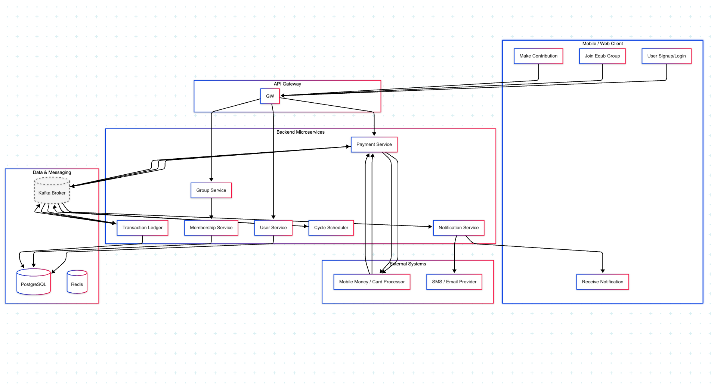

# 1. High-Level System Architecture

## Diagram Components

## Services Breakdown
### API Gateway
- Central access point handling routing, authentication, throttling, and metrics.
- **Recommended**: Kong for on premise(Free open source ) / AWS API GATEWAY for Cloud solution 

### User Service
- Authentication (JWT/OAuth2)
- Handles user registration, authentication (OAuth2/JWT), and profile management.
- **Recommended**: Node.js (Express/NestJS) for rapid development

### Group & Membership Service
- Group creation/management
- Membership lifecycle
- payout rotation logic
- **Recommended**: Java/Spring Boot for complex business logic

### Transaction Ledger Service
- Record all financial transactions
- Immutable audit log of contributions and audits 
- **Recommended**: Java spring boot for performance and concurrency

### Payment Processing Service
- Integrates with external mobile money or card providers to initiate/validate payments.
- Transaction verification
- **Recommended**: Java Spring boot  for payment integrations (ACID)

### Notification Service
- SMS/email/push notifications
- Payout reminders
- **Recommended**: Node.js/ Nest JS  for event-driven notifications

### Scheduler Service
- Manages payout cycles
- Event-driven triggers
- **Recommended**: Spring boot 

### External Integrations
- Mobile money APIs (e.g.,Tele Birr ,M-Pesa), card payment gateways (e.g.,ETHSWITCH)),Local Payment Gateway's(CHAPA, ARIFPAY) AFRO SMS(for messages).

## Communication

### Synchronous
- REST for client-facing APIs

### Asynchronous
- gRPC for internal service communication / 

### Events
- RabbitMQ/Kafka for payout cycles and notifications

## Justification

- architecture using best language for each service type
- Event-driven for scalability in payout processing and notifiation process'es

## Technology Choices & Justification

| Component | Technology | Why |
|-----------|------------|-----|
| Language | Node.js (NestJS) or Java (Spring Boot) | Modular, mature, scalable |
| Database | PostgreSQL (RDS) | ACID, relational integrity, familiar |
| Cache | Redis (ElastiCache) | Rate-limiting, idempotency, fast reads |
| Message Broker | Kafka (MSK) | Reliable event streaming, replay, DLQ |
| API Gateway | Kong / AWS API Gateway | JWT, metrics, plugins, OpenAPI support |
| Orchestration | Kubernetes (EKS) | Autoscaling, fault-tolerance, multi-service support |
| Storage | S3 | Store proof-of-payments or receipts |
| Notifications | Twilio /AFRO SMS(LOCAL) /  Firebase / SES | Multichannel message delivery |
| CI/CD | GitHub Actions + ArgoCD | GitOps, auditability, repeatability |