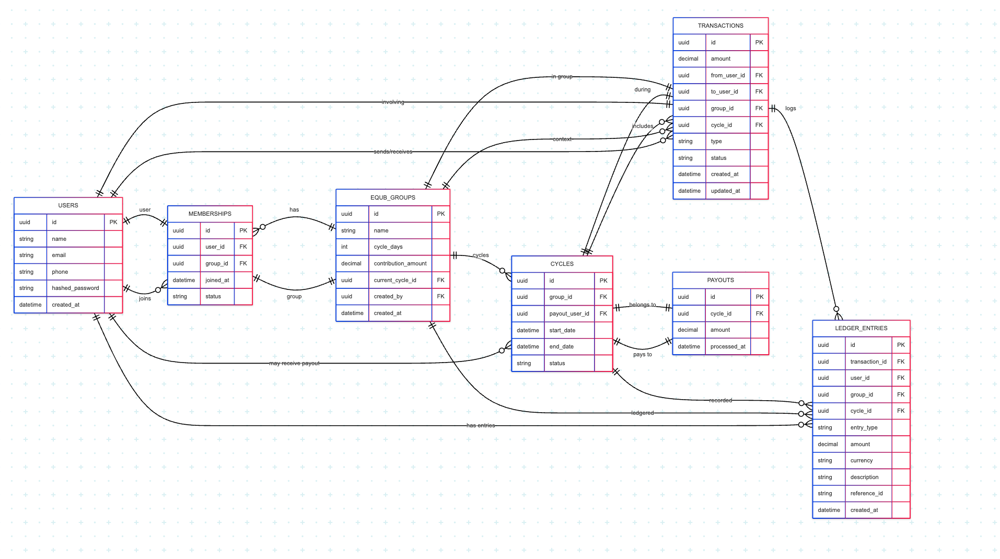

# 2. Digital Equb Platform – Database Design

This page outlines the **database schema**, **design strategy**, and **data handling rationale** for the Digital Equb platform. 
##  Database Choice

## 🗺️ ER Diagram
 

**Primary DBMS**: **PostgreSQL**

###  Why PostgreSQL?
- ACID compliance is critical for financial transactions.
- Strong schema enforcement ensures data integrity.
- Native support for UUIDs, foreign key constraints, and transactions.
- Advanced indexing and partitioning capabilities.
- Native support for `NUMERIC` types for exact financial amounts.

##  Core Entities

### 1. **Users**
Stores authentication and profile information.

| Field          | Type         | Description              |
|----------------|--------------|--------------------------|
| id             | UUID (PK)    | Unique user identifier   |
| name           | VARCHAR      | Full name                |
| email          | VARCHAR (UQ) | Login credential         |
| phone          | VARCHAR (UQ) | Unique phone number      |
| hashed_password| VARCHAR      | Encrypted password       |
| created_at     | TIMESTAMPTZ  | Registration timestamp   |

### 2. **EqubGroups**
Represents a savings group with members and rotating payout cycles.

| Field              | Type         | Description                      |
|--------------------|--------------|----------------------------------|
| id                 | UUID (PK)    | Unique group identifier          |
| name               | VARCHAR      | Group name                       |
| cycle_days         | INTEGER      | Length of each cycle in days     |
| contribution_amount| DECIMAL      | Fixed contribution per member    |
| current_cycle_id   | UUID (FK)    | Reference to the active cycle    |
| created_by         | UUID (FK)    | Group creator                    |
| created_at         | TIMESTAMPTZ  | Timestamp of group creation      |

### 3. **Memberships**
Maps users to groups, capturing join history and status.

| Field     | Type       | Description                  |
|-----------|------------|------------------------------|
| id        | UUID (PK)  | Unique membership ID         |
| user_id   | UUID (FK)  | Linked user                  |
| group_id  | UUID (FK)  | Linked group                 |
| joined_at | TIMESTAMPTZ| Timestamp of joining         |
| status    | VARCHAR    | Active/Left/Removed          |

> Unique Constraint: `(user_id, group_id)`

### 4. **Cycles**
Represents a complete round in the payout sequence.

| Field          | Type         | Description                        |
|----------------|--------------|------------------------------------|
| id             | UUID (PK)    | Unique cycle ID                    |
| group_id       | UUID (FK)    | Linked group                       |
| start_date     | TIMESTAMPTZ  | Start of cycle                     |
| end_date       | TIMESTAMPTZ  | End of cycle                       |
| status         | VARCHAR      | Open/Closed/Failed                 |
| payout_user_id | UUID (FK)    | User who receives the payout       |

### 5. **Transactions**
Tracks contributions and payouts among users per cycle.

| Field        | Type         | Description                      |
|--------------|--------------|----------------------------------|
| id           | UUID (PK)    | Unique transaction ID            |
| amount       | DECIMAL      | Contribution or payout amount    |
| from_user_id | UUID (FK)    | Payer (null for payouts)         |
| to_user_id   | UUID (FK)    | Receiver (null for contributions)|
| group_id     | UUID (FK)    | Associated group                 |
| cycle_id     | UUID (FK)    | Associated cycle                 |
| type         | VARCHAR      | "contribution" or "payout"       |
| status       | VARCHAR      | pending, success, failed         |
| created_at   | TIMESTAMPTZ  | Time of transaction              |
| updated_at   | TIMESTAMPTZ  | Last update                      |

### 6. **Payouts**
Explicitly tracks which user received the total pot per cycle.

| Field       | Type         | Description                |
|-------------|--------------|----------------------------|
| id          | UUID (PK)    | Unique payout ID           |
| cycle_id    | UUID (FK)    | Associated cycle           |
| amount      | DECIMAL      | Total payout amount        |
| processed_at| TIMESTAMPTZ  | Timestamp of disbursement  |

### 7. **Ledger Entries**
Immutable financial audit log for every transaction and payout.

| Field        | Type         | Description               |
|--------------|--------------|---------------------------|
| id           | UUID (PK)    | Unique ledger entry       |
| transaction_id| UUID (FK)   | Associated transaction    |
| user_id      | UUID (FK)    | User related to entry     |
| entry_type   | VARCHAR      | debit/credit/payout       |
| description  | TEXT         | Ledger annotation         |
| amount       | DECIMAL      | Amount recorded           |
| created_at   | TIMESTAMPTZ  | Log timestamp             |

##  Indexing Strategy

| Index Type           | Fields                           | Reason                        |
|----------------------|----------------------------------|-------------------------------|
| FK Indexes           | All FK fields                    | Faster joins                  |
| Composite Index      | `(group_id, cycle_id)` on transactions | Cycle filtering             |
| Partial Index        | memberships where status = 'active' | Query optimization          |
| Unique Constraint    | `(user_id, group_id)`             | Prevents duplicates           |

##  Sharding Strategy

**Sharding Key**: `group_id`

- Partitions the `transactions`, `memberships`, and `cycles` tables.
- Helps distribute load horizontally.
- Ideal for scalability under high group concurrency.

##  Consistency & Transaction Handling

- PostgreSQL's **ACID** guarantees are leveraged for:
  - **Cycle payouts** (must be atomic and isolated)
  - **Contribution processing**
  - **Ledger recording**

- For distributed flows (e.g., notification + payment), the **Saga pattern** or **Outbox pattern** ensures eventual consistency without violating atomicity within services.

