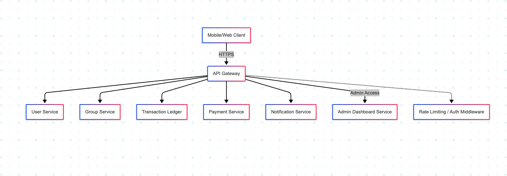

# 🌐 API Gateway, Services & Security Plan

This document outlines the **gateway structure**, **security measures**, and **service communication protocols** for the Equb platform. The goal is to ensure secure, scalable, and fault-tolerant API management across all user-facing and internal services.

---
## 🔐 API GATEWAY ARCHITECTURE

 

## 🔐 Authentication & Authorization

### ✅ Strategy: **JWT-based Authentication**

- **JWT (JSON Web Tokens)** issued by the **Auth Service** after login or registration.
- Token includes `user_id`, `role`, and expiration info.
- Attached in the `Authorization: Bearer <token>` header for all subsequent requests.
- Services validate token signature and expiry using shared public keys (or JWKS endpoint if rotating keys).

### ✅ Role-based Access Control (RBAC)

- **Roles**: `user`, `admin`, `scheduler`
- Each API route is tagged with required roles.
- Permissions enforced in middleware before controller logic.

### ❓ Optional OAuth2 Support
- For future third-party integrations, OAuth2 (Authorization Code Flow) can be used with external identity providers (e.g., Google, Apple).

---

## 🛡️ API Security Measures

| Threat                  | Protection Mechanism                    |
|--------------------------|-----------------------------------------|
| **Rate Limiting**        | Implemented at API Gateway (e.g., NGINX/Kong) using Redis or plugin to block abuse |
| **XSS**                  | Escaping user-generated content; strict CSP headers |
| **CSRF**                 | JWTs stored in `Authorization` header (not cookies); CSRF not applicable |
| **DoS/DDoS**             | Gateway throttling + AWS Shield or WAF (for public APIs) |
| **Input Validation**     | Centralized validation layer (e.g., Joi, class-validator) |
| **CORS Policy**          | Explicitly allowed origins, headers, and methods |
| **Secrets Handling**     | Via AWS Secrets Manager or Kubernetes secrets |

---

## 🔁 Service-to-Service Communication

### ✅ Internal API Calls via mTLS

- All services are on **private subnets** behind a **service mesh** (e.g., Istio or Linkerd)
- Services communicate securely using **mutual TLS (mTLS)** — both sides validate certificates.
- Prevents unauthorized service calls, and supports zero-trust networking.

### Alternative:
For simpler setups, use **shared API keys** with signature-based authentication for internal services, rotated regularly.

---

## 📍 API Gateway Structure

### ✅ Preferred Gateway: **Kong Gateway** (alternative: NGINX or AWS API Gateway)

| Component         | Description                                               |
|------------------|-----------------------------------------------------------|
| **Kong Gateway** | Fronts all public APIs, handles authentication, rate-limiting, service discovery |
| **Plugins**       | Used for JWT validation, IP filtering, logging, circuit breaking |
| **Ingress Controller** | If on Kubernetes, used as `Ingress` resource controller |
| **DNS Management** | Route requests like `/auth`, `/group`, `/payment` to services |
| **Fallbacks**     | Configured for failure handling and retries automatically |

---
## 🔀 Clear Route Handling & Service Protection

- **Route Mapping**: API Gateway routes are clearly defined using tags like `/api/v1/users`, `/api/v1/groups`, etc.
- **Path-based Routing**: Directs traffic to specific services (e.g., `/api/v1/payments` → Payment Service).
- **Header-based Filtering**: Allows routing by `X-Service-Type` for admin/user differentiation.
- **JWT Scope Verification**: Each route requires a valid JWT with appropriate permissions (e.g., `admin:read`, `user:contribute`).
- **Input Validation**: Gateway integrates request validation middleware for schema and size limits before passing to services.
- **Audit Logging**: All requests are logged with request metadata, user ID, IP address, and timestamp for security auditing.

## ⚖️ Gateway Load Balancing & Failure Recovery

### Load Balancing

- **Horizontal Scaling**: The API Gateway (e.g., Kong or NGINX) is horizontally scaled across multiple availability zones.
- **Kubernetes LoadBalancer or AWS ALB/NLB**: Fronts the gateway, distributing traffic evenly.
- **Health Checks**: Built-in health checks remove unhealthy gateway pods from rotation.

### Failure Recovery

- **Retry Policies**: Automatically retries transient 5xx failures at the gateway layer for idempotent requests.
- **Circuit Breakers**: Prevent cascading failures by halting traffic to misbehaving services temporarily.
- **Fallback Routes**: Graceful degradation for known errors (e.g., route to static maintenance message service).
- **Global Timeout Settings**: Prevents long-hanging requests from consuming all resources.
- **Rate-Limiting with Token Bucket/Leaky Bucket Algorithm**: Mitigates flood attacks.

## 🔄 Request Flow

 
---

## 🧩 Future Extensions

- OAuth2 or OpenID Connect for third-party app integrations
- gRPC support with mTLS for internal service communication
- Service mesh observability using Jaeger tracing or Grafana Tempo
