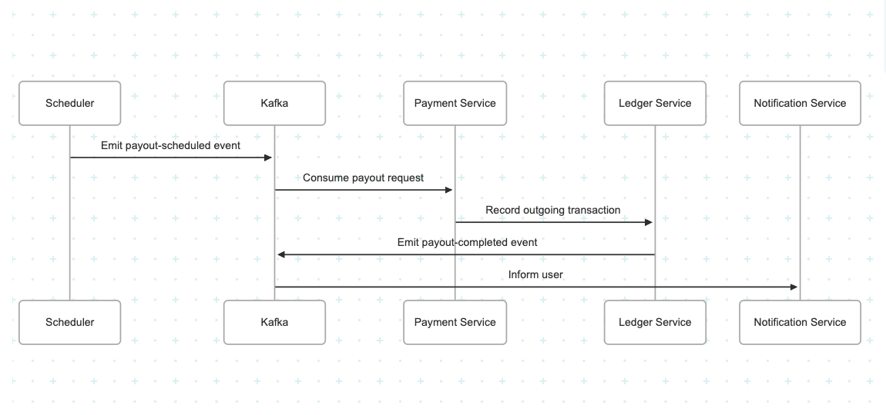
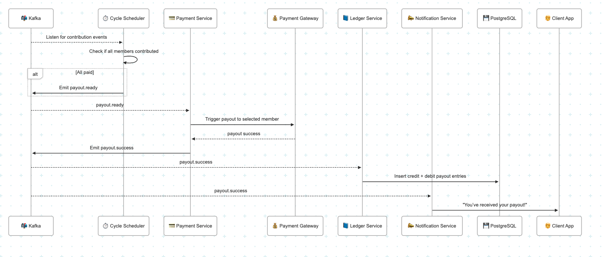
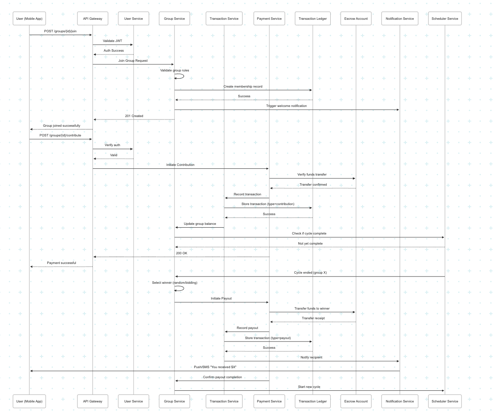

# 💸 Transaction & Payout Logic Strategy – Digital Equb Platform

This document outlines the robust, fault-tolerant, and scalable design for managing transactions and payouts in the Digital Equb application.

---

## ✅ 1. Transaction Flow Overview

The transaction flow covers user contributions (deposits), transaction recording, and payout triggering.

### 🧾 Steps:
1. **User** makes a contribution via the mobile app.
2. **API Gateway** validates the request (JWT).
3. **Payment Service** initiates escrow transfer to Equb's account.
4. **Ledger Service** logs the contribution as a `transaction`.
5. **Scheduler** checks if the current cycle can close.
6. **Cycle marked complete**, triggering payout.

---

## ✅ 2. Atomicity Enforcement (No Double Payouts)

- **Database-level constraints**:
  - `UNIQUE(cycle_id, to_user_id)` in the `payouts` table.
- **Idempotent payout processor**:
  - Uses `transaction_idempotency_key` to ensure single execution.
- **PostgreSQL transactions**:
  - Ensures all-or-nothing updates when recording payouts.

---

## ⏳ 3. Payout Scheduling

### 🔁 Strategy:
- Event-driven, handled by **Scheduler Service**.
- Triggered via:
  - Contribution thresholds met
  - Time-based (cron)
- **Winner selection logic**:
  - FIFO
  - Random
  - Bidding (future roadmap)

---

## 💥 4. Simulating Payment Failures

| Type                | Test Method                        |
|---------------------|------------------------------------|
| Network Timeout     | Drop requests via `Toxiproxy`      |
| Payment Rejection   | Mock 400/403/422 responses         |
| Retry Exhaustion    | Limit retries in dev environment   |

---

## 🔁 5. Failure Recovery

- **Retry Logic**:
  - 3 attempts: 10s → 30s → 90s
  - Handled via queue (BullMQ or RabbitMQ consumer retry)
- **Dead-Letter Queues (DLQs)**:
  - Failed payouts logged in `payout.failed` topic
  - Manual reprocessing supported
- **Alerting**:
  - Prometheus → Alertmanager → Slack/Email

---

## 📡 6. Messaging Patterns

| Flow                          | Type           | Pattern     |
|-------------------------------|----------------|-------------|
| Contribution event            | Async          | Pub/Sub     |
| Payout trigger                | Event-based    | Direct      |
| Notification dispatch         | Fan-out        | Kafka       |
| Payment gateway response      | Sync (REST)    | RPC         |

- **Broker**: Kafka (preferred) or RabbitMQ
- **Benefits**:
  - Decoupled services
  - Replay support
  - High throughput

---

## 🔌 7. Payment Service Interaction

---

## 📊 8. End-to-End Visual Reference

This diagram shows how all services interact from contribution to payout including retry and failure-handling layers.

---

## ✅ Summary

| Topic                  | Solution                                  |
|------------------------|-------------------------------------------|
| Atomicity              | DB locks + unique constraints             |
| Scheduling             | Event or cron-based                       |
| Failure Handling       | Retry + DLQ + alerting                    |
| Messaging              | Kafka/RabbitMQ with pub-sub + fan-out     |
| Service Interaction    | REST for payments, events for rest        |
| Auditability           | Transaction ledger + payout log           |

This strategy ensures high **resilience**, **scalability**, and **financial integrity** for all Equb transactions and payouts.

---