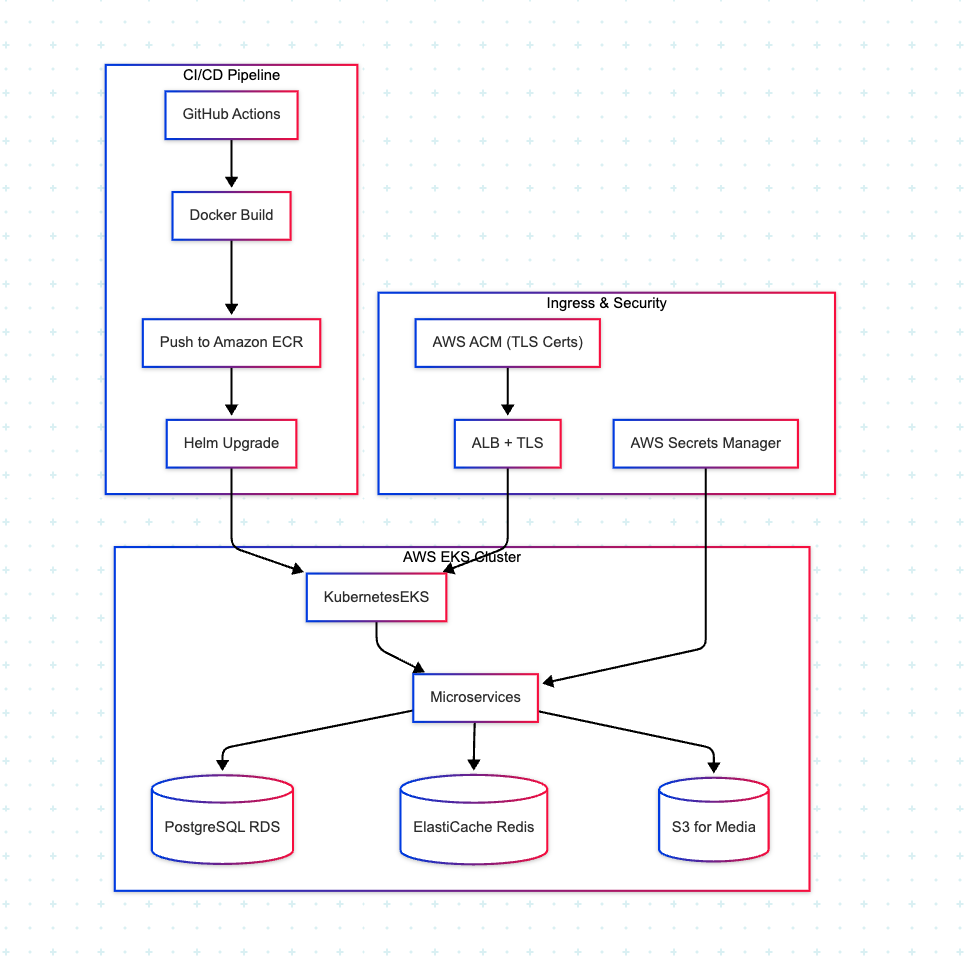

# 🏗️ Infrastructure Setup Plan – Digital Equb (AWS EKS)

This guide provides a comprehensive deployment strategy for containerizing, orchestrating, and automating the Digital Equb platform on AWS using Docker, Kubernetes (EKS), and GitHub Actions.

---
 


## 🐳 Containerization Strategy – Docker

All microservices (e.g., `auth`, `group`, `payment`, `ledger`, `notification`) are Dockerized using multi-stage builds for performance and security.

### ✅ Key Practices:
- Base images: `node:18-alpine`, `openjdk:17-slim`, or `python:3.11-slim`
- Non-root users and minimized OS layers
- `.dockerignore` for clean contexts
- Health check endpoints exposed (`/healthz`)

### 🛠 Example Dockerfile
```Dockerfile
FROM node:18-alpine AS build
WORKDIR /app
COPY . .
RUN npm install && npm run build

FROM node:18-alpine
WORKDIR /app
COPY --from=build /app/dist ./dist
COPY --from=build /app/node_modules ./node_modules
CMD ["node", "dist/main.js"]
```

---

## ☸️ Kubernetes Orchestration – Amazon EKS

Amazon Elastic Kubernetes Service (EKS) provides the managed control plane and worker nodes for running containerized services.

### 🌐 Cluster Topology:
- Region: `us-east-1`
- Zones: `us-east-1a`, `us-east-1b`
- Multi-AZ for high availability
- Node groups:
  - `default-ng`: for general services
  - `payment-ng`: for high-priority workloads

### 🧱 Node Setup with eksctl
```bash
eksctl create cluster   --name equb-platform   --region us-east-1   --zones us-east-1a,us-east-1b   --nodegroup-name default-ng   --node-type t3.medium   --nodes 3   --managed
```

### 🔧 Post-Setup
```bash
aws eks update-kubeconfig --name equb-platform
kubectl get nodes
```

---

## 🚀 CI/CD Pipeline – GitHub Actions + Docker + Helm

All services follow the same GitOps-style CI/CD pipeline.

### 🧪 CI Workflow:
- Lint and test
- Build Docker image
- Push to Amazon ECR
- Trigger ArgoCD via GitOps repo (optional)

### ⚙️ GitHub Actions Example
```yaml
name: CI/CD Pipeline

on:
  push:
    branches:
      - main
      - release/*

jobs:
  deploy:
    runs-on: ubuntu-latest

    steps:
      - uses: actions/checkout@v3

      - name: Log in to ECR
        run: |
          aws ecr get-login-password --region us-east-1 | \
          docker login --username AWS --password-stdin <your-account-id>.dkr.ecr.us-east-1.amazonaws.com

      - name: Build Docker image
        run: |
          docker build -t equb/payment-service:latest .
          docker tag equb/payment-service:latest <ecr-uri>/payment-service:latest

      - name: Push Docker image
        run: docker push <ecr-uri>/payment-service:latest

      - name: Helm Upgrade
        run: |
          helm upgrade --install payment-service ./helm \
          --namespace equb \
          --set image.tag=latest
```

---

## 🔐 Secrets Management

| Tool                  | Use                                      |
|-----------------------|-------------------------------------------|
| AWS Secrets Manager   | JWT keys, DB credentials, external APIs  |
| Kubernetes Secrets    | Injected via environment or volume mount |
| IAM Roles for SA (IRSA)| Secure service-to-AWS API access         |

---

## 🗂️ Namespace Layout

| Namespace   | Purpose                          |
|-------------|----------------------------------|
| `auth`      | Auth + user profile services     |
| `group`     | Group & membership services      |
| `payment`   | Payment + payout services        |
| `ledger`    | Transaction & audit              |
| `infra`     | Monitoring, logging, ingress     |
| `admin`     | Back office tools + dashboards   |

---

## 📂 Helm Directory Structure
```
helm/
├── charts/
│   ├── auth/
│   ├── payment/
│   ├── ledger/
│   └── group/
├── templates/
│   └── common.yaml
└── values/
    ├── dev.yaml
    └── prod.yaml
```

---


---

## ✅ Summary

| Layer               | Tool/Service                      |
|---------------------|-----------------------------------|
| Containerization    | Docker                            |
| Registry            | Amazon ECR                        |
| Orchestration       | Amazon EKS                        |
| Secrets             | AWS Secrets Manager + IRSA        |
| CI/CD               | GitHub Actions + Helm             |
| Deployment Model    | GitOps-friendly, versioned builds |
| Security            | TLS via ACM, RBAC, scoped Secrets |

This setup is designed for **high availability**, **secure infrastructure**, and **automated rollouts** of your backend services on AWS.